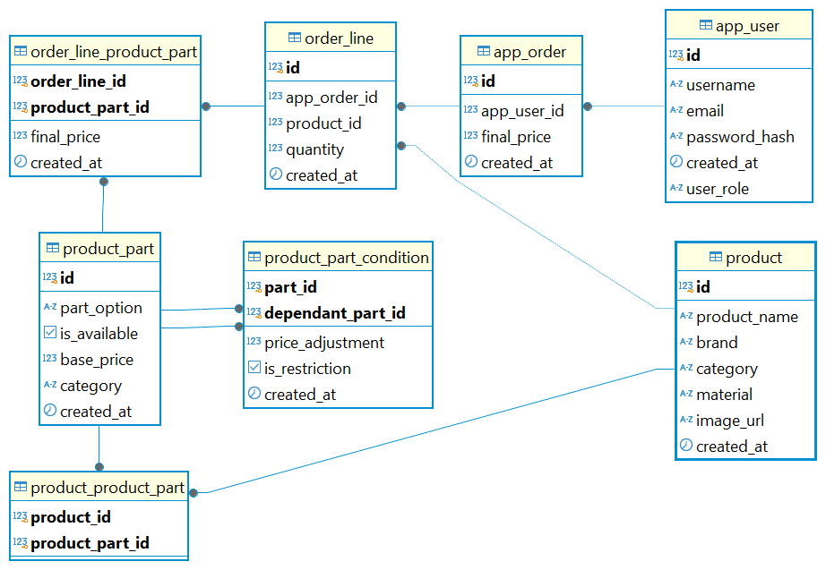

# Sporting Equipment Management (Factorial Exercise)

This repository contains my solution for Factorial's challenge on managing sporting equipment in a retail environment.

## Overview

This exercise is designed as a **framework-less solution** using **Java-based technologies** for the backend, along with **PostgreSQL** and **React**.

The application allows users to:
- View a list of available products.
- Create and manage new orders.
- Log in as a user or admin for role-based access.
- Modify existing products and their available parts.
- Delete existing products from the system.
- Apply various types of restrictions to customer product selections.
- Customize and select parts for a specific product.
- View detailed product information and part availability.
- Manage the product parts related to each product (add, remove, update).
- Add products and product parts via admin interface.
- Add selected products with customized parts to the shopping cart.
- Display and handle error messages for invalid selections or actions.


The solution is based on the **purchase of customizable sporting goods**, meaning that an order consists of multiple components or parts.

## Application Views
The app currently contains the following views:

- **Home Page**: Placeholder page with no significant functionality.
- **Product List Page**: Displays a list of available products.
- **Order Creation Page**: Allows users to create an order by selecting multiple options, validating selections, checking prices, and finalizing the order.
- **404 Page**: Displays an error page for invalid routes.

**Admin Views**:
- **Admin Dashboard**: Provides three buttons for managing products, parts, and orders (currently without significant functionality).
  - **Product Management Modal (Admin)**: Opens for adding, editing, and deleting products.
  - **Parts Management Modal (Admin)**: Opens for adding, editing, and deleting product parts.
  - **Conditions Management Modal (Admin)**: Opens for adding and deleting product part conditions.


### **General Requirements**
- ☕ **Java 17** → Required for backend development. Install from [Oracle](https://www.oracle.com/java/technologies/javase/jdk17-archive-downloads.html) or your preferred JDK provider.
- ⚙️ **Maven** → Used for managing backend dependencies. Install from [Apache Maven](https://maven.apache.org/download.cgi).
- 🗄️ **PostgreSQL** → Relational database for storing application data. Install from [PostgreSQL](https://www.postgresql.org/download/) You can also use a .
- 🟢 **Node.js (LTS version)** → Required for frontend development. Install from [Node.js](https://nodejs.org/).
- 📦 **npm or yarn** → Package managers for installing frontend dependencies (npm is part of Node.js).
# 🛠️ Tools & Libraries Used

## 🔹 Backend

### Core Technologies  
- [Java 17](https://www.oracle.com/java/technologies/javase/jdk17-archive-downloads.html) – Programming language used for backend development.  
- [Maven](https://maven.apache.org/) – Dependency manager and build automation tool.  
- [Undertow](https://undertow.io/) – Lightweight and high-performance web server.  
- [PostgreSQL](https://www.postgresql.org/) – Relational database used for data storage.  
- [HikariCP](https://github.com/brettwooldridge/HikariCP) – High-performance JDBC connection pool for efficient database access.  
- [Flyway](https://github.com/flyway/flyway) – Database migration and version control tool.  
- [Jackson Databind](https://github.com/FasterXML/jackson-databind) – JSON serialization and deserialization library.  
- [Jackson JSR310](https://github.com/FasterXML/jackson-modules-java8) – Provides support for Java Date/Time API in JSON processing.  
- [SLF4J](https://www.slf4j.org/) – Logging abstraction framework.  
- [Logback](https://logback.qos.ch/) – Logging implementation for SLF4J.   
- [JWT (JSON Web Token)](https://jwt.io/) – For handling authentication and authorization with tokens.   

### Build & Execution  
- [Exec Maven Plugin](https://www.mojohaus.org/exec-maven-plugin/) – Enables running Java applications using Maven.  
- [Flyway Maven Plugin](https://flywaydb.org/documentation/usage/maven/) – Automates and manages database migrations.  

### Database Management (Optional)  
- [DBeaver](https://dbeaver.io/) – GUI-based database management tool for PostgreSQL.  

---

## 🎨 Frontend Technologies & Dependencies  

### Core Dependencies  
- [React](https://react.dev/) – JavaScript library for building dynamic user interfaces.  
- [React DOM](https://react.dev/) – React package for interacting with the browser DOM.  
- [React Router DOM](https://reactrouter.com/) – Enables client-side routing for single-page applications.  
- [Axios](https://axios-http.com/) – HTTP client for making API requests.  
- [Formik](https://formik.org/) – Form management library for handling user input in React.  
- [React Icons](https://react-icons.github.io/react-icons/) – Collection of vector icons for React applications.  
- [Styled Components](https://styled-components.com/) – Library for writing CSS directly inside React components.  

### Development Dependencies  
- [TypeScript](https://www.typescriptlang.org/) – Strongly typed superset of JavaScript for better maintainability.  
- [Vite](https://vitejs.dev/) – Modern build tool and fast development server.  
- [ESLint](https://eslint.org/) – Linter for enforcing code quality and best practices.  
- [Prettier](https://prettier.io/) – Code formatter to maintain consistent style.  
- [TypeScript ESLint](https://typescript-eslint.io/) – Integrates ESLint with TypeScript.  
- [React Hooks ESLint Plugin](https://www.npmjs.com/package/eslint-plugin-react-hooks) – Ensures correct usage of React Hooks.  
- [Vite React Plugin](https://www.npmjs.com/package/@vitejs/plugin-react) – Provides React support for Vite.  
- [Globals](https://www.npmjs.com/package/globals) – Defines global variables for ESLint.  

## 🛠️ Project Setup

### 📥 Clone the Repository

```
git clone https://github.com/ezepsosa/marcus_bike_project.git
cd <project-folder>
```

### ⚙️ Backend Installation

#### 1. Ensure PostgreSQL is Running  
Make sure you have **PostgreSQL** running with a properly configured database.

#### 2. Update Database Configuration  
Modify the `flyway.conf` file located at:

```
marcus-bike-api/src/main/resources/flyway.conf
```

Update only the following lines with your PostgreSQL credentials:

```
flyway.url=POSTGRESQL-URL
flyway.user=POSTGRESQL-USER
flyway.password=POSTGRESQL-PASSWORD
```

📌 **Important**: Only edit these lines.

#### 3. Run Database Migrations with Flyway  
Execute the following command to apply the database scripts:

```
mvn flyway:migrate
```

🛠️ If you want to clean the database before running the migrations, execute:

```
mvn flyway:clean
```

#### 4. Build and Run the Backend  
Ensure you are in the `marcus-bike-api` directory and run:

```
mvn clean package
mvn exec:java
```


### 🎨 Frontend Installation

#### 1. Navigate to the Frontend Directory  

```
cd marcus-bike-client
```

#### 2. Install Dependencies  

```
npm install
```

#### 3. Start the Frontend  

```
npm run dev
```


### ✅ Running the Application

Once both the backend and frontend are running:

- The **backend** will be available at:  
  ```
  http://localhost:8080/api
  ```
- The **frontend** will be available at:  
  ```
  http://localhost:5173
  ```

You can test the API using **Postman**, **cURL**, or any other API testing tool.


## 🏛️ Project front structure
        .
        marcus-bike-project
        │── marcus-bike-api
        │   ├── pom.xml
        │   ├── src
        │   │   ├── main
        │   │   │   ├── java/com/ezepsosa/marcusbike
        │   │   │   │   ├── App.java
        │   │   │   │   ├── config/ (Application Configuration)
        │   │   │   │   ├── controllers/ (REST API Controllers)
        │   │   │   │   ├── dto/ (Data Transfer Objects)
        │   │   │   │   ├── mappers/ (Object Mappers)
        │   │   │   │   ├── models/ (Database Models)
        │   │   │   │   ├── repositories/ (Data Access Layer)
        │   │   │   │   ├── routes/ (API Routing and CORS)
        │   │   │   │   ├── security/ (JWT handling security)
        │   │   │   │   ├── services/ (Business Logic)
        │   │   │   │   ├── utils/ (Helper Utilities)
        │   │   │   ├── resources/
        │   │   │   │   ├── flyway.conf
        │   │   │   │   ├── logback.xml
        │   │   │   │   ├── db/migration/ (Database Migration Scripts)
        │   │   ├── test/
        │   │   │   ├── java/com/ezepsosa/marcusbike/AppTest.java
        │── marcus-bike-client
        │   ├── package.json
        │   ├── tsconfig.json
        │   ├── vite.config.ts
        │   ├── src/
        │   │   ├── assets/ (Static Images & Icons)
        │   │   ├── components/ (Reusable UI Components)
        │   │   ├── conext/ (Context components)
        │   │   ├── models/ (Type Definitions)
        │   │   ├── pages/ (Application Views)
        │   │   ├── routes/ (Client-side Routing)
        │   │   ├── server/ (API Service Calls)
        │   │   ├── styles/ (Global & Shared Styles)
                
### Database Model



## 📡 API Endpoints
### Users
- **GET `/users`** → Retrieves a list of all users (Requires ADMIN role).
- **GET `/users/{id}`** → Retrieves details of a specific user (Requires ADMIN role).
- **POST `/users`** → Creates a new user.
- **PUT `/users/{id}`** → Updates an existing user (Requires USER or ADMIN role).
- **DELETE `/users/{id}`** → Deletes a user by ID (Requires ADMIN role).

### Product Parts & Conditions
- **GET `/productpartconditions`** → Retrieves all product part conditions.
- **POST `/productpartconditions`** → Creates a new product part condition (Requires ADMIN role).
- **DELETE `/productpartconditions/{productpartid}/{dependantproductpartid}`** → Deletes a product part condition (Requires ADMIN role).

### Product Parts Management
- **GET `/productparts`** → Retrieves all product parts.
- **POST `/productparts`** → Creates a new product part (Requires ADMIN role).
- **PUT `/productparts/{id}`** → Updates an existing product part (Requires ADMIN role).
- **DELETE `/productparts/{id}`** → Deletes a product part by ID (Requires ADMIN role).
- **GET `/products/{id}/productparts`** → Retrieves all product parts related to a specific product.
- **POST `/products/{id}/productparts`** → Adds a relation between a product and a product part (Requires ADMIN role).
- **DELETE `/products/{productId}/productparts/{id}`** → Removes a product part from a product (Requires ADMIN role).

### Products
- **GET `/products`** → Retrieves a list of all products.
- **GET `/products/{id}`** → Retrieves details of a specific product.
- **POST `/products`** → Creates a new product (Requires ADMIN role).
- **PUT `/products/{id}`** → Updates an existing product (Requires ADMIN role).
- **DELETE `/products/{id}`** → Deletes a product by ID (Requires ADMIN role).

### Orders
- **GET `/orders`** → Retrieves a list of all orders.
- **GET `/orders/{id}`** → Retrieves details of a specific order.
- **GET `/users/{userId}/orders`** → Retrieves all orders placed by a specific user.
- **POST `/orders`** → Creates a new order (Requires USER or ADMIN role).
- **DELETE `/orders/{id}`** → Deletes an order by ID (Requires USER or ADMIN role).
- **GET `/orders/{id}/orderlines`** → Retrieves order lines associated with a specific order.

### Login
- **POST `/login`** → Authenticates a user and returns an authentication token.

             
## 🔍 Technical Rationale

### 🏗️ **Backend architecture overview**  
The system follows a **modular design** based on the following principles:  

- **Separation of Concerns (SoC):**  
  - Each layer of the application has a clear and specific responsibility.  
  - Business logic, data access, and presentation layers are strictly separated.  
- **Manual Dependency Injection:**  
  - Avoids the use of IoC frameworks, providing full control over the lifecycle of objects.  
  - Ensures transparency in dependency management.  
- **DAO-Based Data Access with Raw SQL:**  
  - No ORM is used, allowing full control over SQL queries.  
  - Queries are optimized manually for performance and efficiency.  

- **Explicit and Lightweight Configuration:**  
  - The system is fully configurable without relying on annotations or implicit framework configurations.  

#### Library selection & Justification

The project leverages lightweight, modern, and well-maintained libraries to ensure high performance, maintainability, and efficiency while avoiding unnecessary dependencies:

- **Undertow**: Selected for its simplicity and superior efficiency in high-concurrency environments compared to Jetty and Tomcat.
- **HikariCP**: A high-performance JDBC connection pool optimized for heavy workloads, offering significantly better performance than Apache DBCP.
- **PostgreSQL JDBC Driver**: Provides full control over SQL queries, enhancing database efficiency and allowing for manual query optimization. The decision to avoid Hibernate was also driven by the desire to increase project complexity and challenge.
- **Flyway**: Chosen for its simplicity and effectiveness in managing database migrations, ensuring a structured and version-controlled approach.
- **Jackson**: A highly efficient and configurable JSON serialization library, widely adopted in Java applications.
- **SLF4J + Logback**: A flexible and lightweight logging solution, offering easy configuration and broad industry adoption.
- **JWT (JSON Web Token)**: Chosen for its simplicity and security in handling user authentication and authorization. It enables secure, stateless authentication by generating tokens upon user login.


### 🎨 **Frontend Architecture Overview**  

The frontend follows a **modular and scalable** structure to ensure maintainability and efficiency.  

- **Component-Based Structure**  
  - The UI is built with **React functional components**, making it **reusable and easy to maintain**.  
  - Each component focuses on a single responsibility, improving organization.  

- **Routing & Navigation**  
  - Uses **React Router DOM** to manage navigation between pages.

- **Styling Approach**  
  - Uses **Styled Components** to apply CSS within components, keeping styles modular and easy to manage.  

- **API Integration**  
  - Uses **Axios** to fetch and send data from the backend, handling requests efficiently.  

### **Conclusion**  

This **framework-less** approach was chosen to keep the application lightweight, scalable, and fully customizable. The selected libraries ensure:

- **High performance**, avoiding unnecessary abstractions.
- **Scalability**, with a modular structure that can be expanded easily.
- **Full control**, allowing direct management of configurations and dependencies.*


### 🚧 Future improvementes
- Implement tests for both backend and frontend to improve reliability.  
- Add a dedicated login endpoint.  
- Add more business logic validations to enforce data integrity and application rules.  
- Improve error handling by making responses more consistent and easier to debug.  
- Refine how user conditions are managed (currently handled via a database trigger but could also be controlled in frontend and backend).  
- Optimize database queries by reducing redundancy and improving indexing.  
- Implement a refresh token mechanism to avoid requiring frequent logins.  
- Improve logging and monitoring. 
- Provide API documentation using Swagger/OpenAPI for better maintainability and ease of use.  
- Add new attributes to the models, such as the product category attribute, to enable future filtering by specific product categories when the store expands beyond just selling bicycles.
- Improve UI and styling for better consistency and user experience.  
- Add a registration page 
- Add JWT authentication to manage user sessions securely.  
- Improve user experience by adding better loading indicators, clearer error messages, and stronger validation.
- Add more client-side validation to reduce unnecessary API calls.  
- Improve product search and filtering options.  
- Add pagination.
- Improve type safety in the React application.
- Fix the issue with select fields where Formik doesn't maintain the initial value when left as default in some selects.
- Error propagation.

## 📌 Final Notes  

This project was built as part of a technical challenge, focusing on backend and frontend development, database design, and API architecture.

If any clarifications are needed, feel free to reach out. 🙂  
